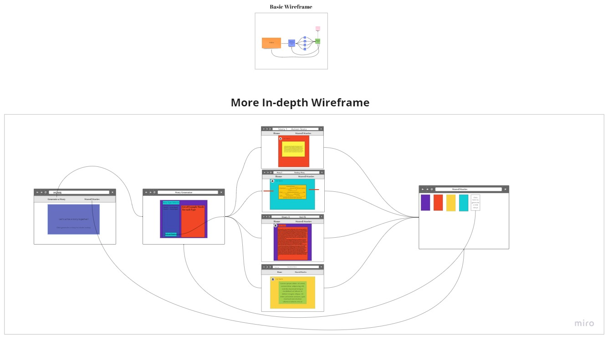

# word-game-app

## Project Members

* Abdinasir Yussuf
* Thomas Basham
* James Brooks
* Marcus Hartwig

## Project Description

---

### MadLibs

webpage that takes user inputs from a series of prompts that generates a creative
story from that input.

#### problem it solves:

* this will solve the users boredom by engaging their brain in a nice story driven rpg
* the user will get inspiration from exercising their creativity.

#### define minimum viable product:

a form with user submission that persists data to the story that renders to another page.
- [User Stories](https://github.com/orgs/team-Beverly-Hills/projects/1)

;
